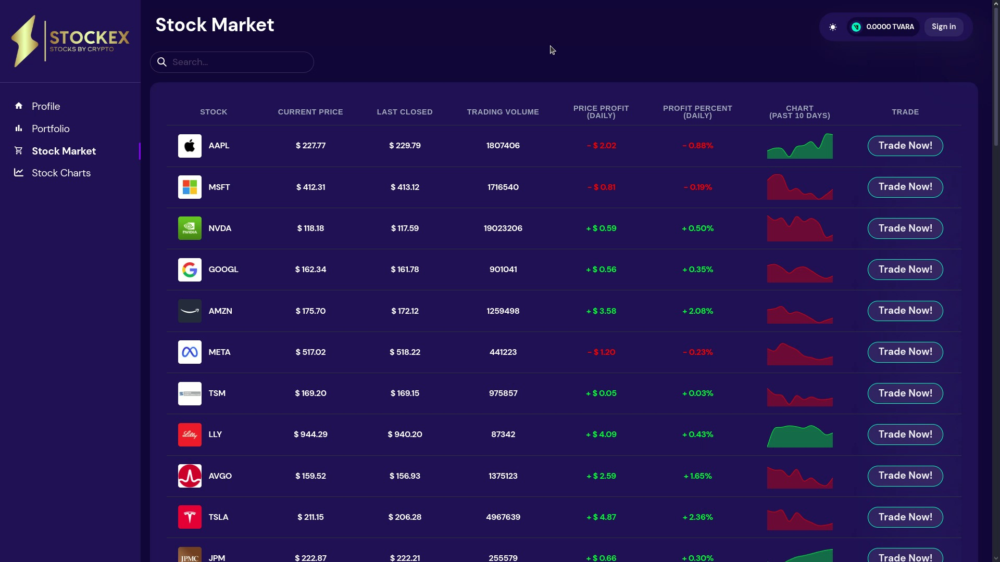
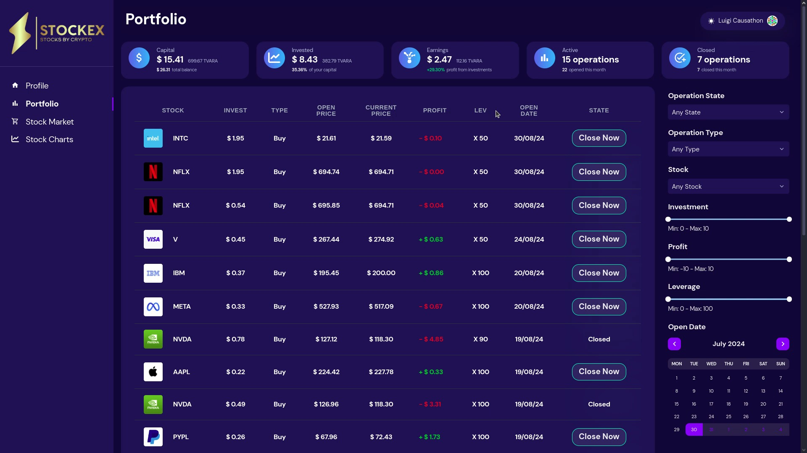
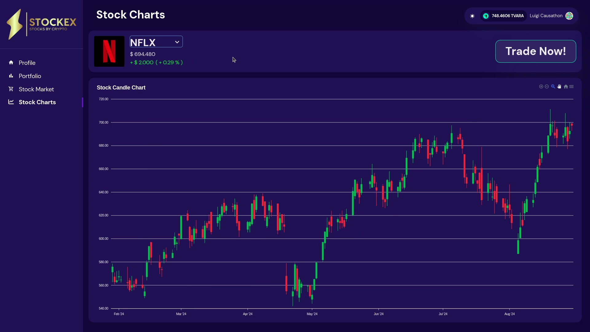
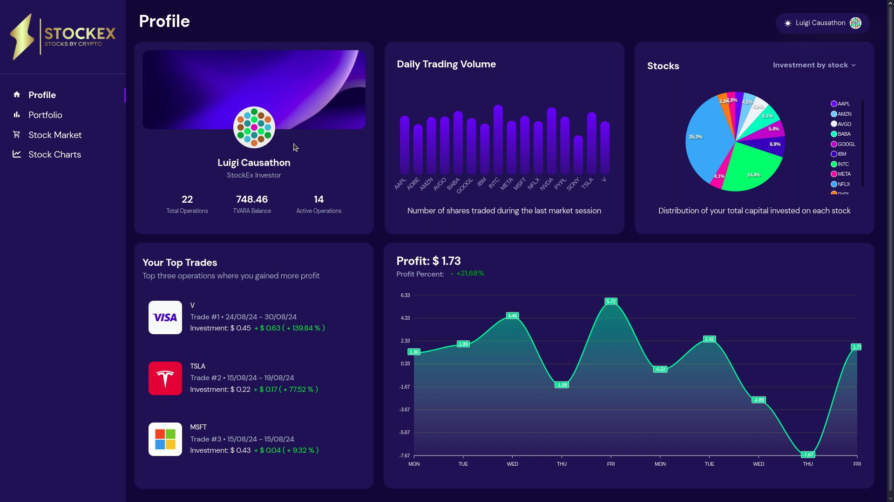

# StockEx - The Future of Trading 💹🚀

Welcome to **StockEx**, the ultimate platform that makes stock trading seamless, powerful, and user-friendly. With StockEx, you're in control of your investments with an intuitive UI, real-time analytics, and advanced trading features. Whether you're a beginner or a seasoned trader, StockEx provides the tools you need to succeed in the stock market.

## 🚀 Hackathon Participation

We're thrilled to announce that StockEx is a proud participant in the **Vara Hackathon**! We're pushing the boundaries of innovation and trading technology, showcasing what StockEx is capable of in this exciting competition.

## 🎥 Demo Video

Check out our epic demo video to see StockEx in action:
[StockEx Demo](https://drive.google.com/file/d/1f-nDZzRm3HhAk1iMako4XB6QajGIcaYI/view?usp=sharing)

<!-- <video width="640" height="480" controls>
  <source src="Media/StockEx App Final Demo.mp4" type="video/mp4">
  Your browser does not support the video tag.
</video> -->

 

## Social Media
### **X:** [@stockex_vara](https://x.com/stockex_vara)
### **Instagram:** [@stockex.vara](https://www.instagram.com/stockex.vara)

 

## 🔗 Smart Contracts

### **StockEx Data provider - Smart Contract**
The StockEx Smart Contract allows you to interact with stock data on the VARA Network. The contract supports fetching and updating stock prices, managing historical stock prices, and other operations related to stock trading.

### Data provider Smart Contract: [StockEx Data Provider](https://idea.gear-tech.io/programs/0xb5ab8b7ba2e6614ca193df7e7be9e33aca04297f2baed230a3217d0f12355c18)

 

### **StockEx Operation Manager - Smart Contract**

This smart contract is designed for managing stock trading operations on the VARA blockchain. It enables users to buy and sell stocks using VARA crypto, interact with a provider contract to fetch stock and currency prices, and manage the state of these operations.

### Operation Manager Smart Contract: [StockEx Operation Manager](https://idea.gear-tech.io/programs/0x90ab0b5bbe25d9459911e06614e1e2faf73b21d11409dda612890af32a63c7d9)

 

## 🌟 DApp Front End Features
### Stock Market Section
- **Real-Time Stock Listings**: Browse through a wide range of stocks with real-time price updates.
- **Detailed Information**: Get detailed information about the stock trend, such as the latest and current prices, trading volume, and earnings over the past few days.
- **Comprehensive Trading Panel**: Place buy and sell orders effortlessly. Review your order details before confirming trades for a seamless experience.

### Portfolio Management
- **Real-Time Tracking**: Keep track of all your trades with a comprehensive portfolio section.
- **Mini-Statistics**: Get an instant overview of your capital, invested money, current earnings, and the number of active/closed operations.
- **Detailed Trade Info**: View the stock ticker, logo, invested value, operation type, open/current prices, profit/loss, leverage, and trade date.
- **Close Trades**: Easily close any open trades with a single click. Just sign the transaction, and it's done!
- **Powerful Filters**: Search and filter your trades by operation state (open/closed), type (buy/sell), stock, profit range, leverage, and trade date.

### Stock Charts
- **Trend Analysis**: View detailed candlestick charts for your favorite stocks.
- **Real-Time Price Display**: See the current price and daily profit generated by each stock.
- **Interactive Candlestick Chart**: Hover over candles for detailed price fluctuation data and zoom into specific sections for a closer look.
- **Quick Trading**: Invest in any stock directly from the chart with the trade button.

### Profile Section
- **Wallet Overview**: Check your Polkadot wallet balance and operation details.
- **Trading Volume Bar Chart**: Track the trading volume of all your invested stocks on the current market.
- **Interactive Pie Chart**: View the distribution of your investments across different stocks. Switch to see the percentage of active/closed operations or buy/sell operation types.
- **Top Trades**: Stay motivated by tracking your most profitable trades.
- **Profit Line Chart**: Monitor the daily fluctuation of your profit with an out-of-this-world line chart.

## 📜 License
StockEx is developed and maintained by our amazing team.
The platform is continually evolving, and we welcome your feedback!

---

With **StockEx**, you're not just trading; you're mastering the market. Whether it's real-time analytics, interactive charts, or powerful filtering options, StockEx gives you the edge. Get started today and experience the future of trading!
